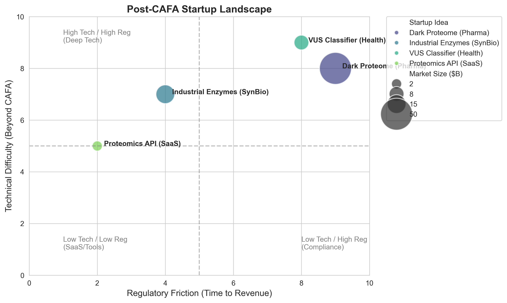

# Post-CAFA Startup Opportunities

Success in CAFA implies mastery of three high-value domains: **Geometric Deep Learning (GCNs)**, **Protein Language Models (pLMs)**, and **High-Dimensional Hierarchical Classification**.

Here are four concrete startup vectors where this specific tech stack translates into venture-backable equity, ranked by technical feasibility vs. regulatory friction.

### 1. The "Dark Proteome" De-risking Engine (Pharma/Biotech)
**The Problem:** ~35% of the human proteome is "understudied" or has unknown function (the Dark Proteome). Pharma ignores these targets because the risk of failure is too high.
**The CAFA Edge:** Your pipeline doesn't just predict function; it provides **confidence intervals** (via Information Accretion weights).
**The Startup:**
*   **Product:** A B2B platform that identifies novel drug targets within the Dark Proteome for specific diseases (e.g., fibrosis, rare genetic disorders).
*   **Tech:** Use your GCN stack to predict molecular functions (MF) and biological processes (BP) for orphan proteins, then cross-reference with disease-associated expression data.
*   **Business Model:** IP generation. You predict the target, validate it in a contract lab (CRO), and sell the asset to Pharma.

### 2. Industrial Enzyme Discovery (SynBio/AgTech)
**The Problem:** Chemical manufacturing is dirty. Industries want to replace heavy metal catalysts with enzymes (biocatalysis), but finding an enzyme that survives high heat/pH is hard.
**The CAFA Edge:** ESM2/T5 embeddings capture evolutionary stability.
**The Startup:**
*   **Product:** "Search engine" for extremophiles. You take a desired chemical reaction (GO term), and your model finds bacterial proteins from deep-sea vents or hot springs that perform that function.
*   **Tech:** Invert your pipeline. Instead of Sequence $\to$ Function, query Function $\to$ Top-k Sequences from metagenomic databases.
*   **Business Model:** Service/Royalty. Chemical companies pay you to find an enzyme that degrades plastic or synthesizes nylon.

### 3. Variant of Uncertain Significance (VUS) Classifier (Diagnostics)
**The Problem:** Genetic testing finds thousands of mutations. Clinicians often classify them as "VUS" (we don't know if it's bad) because they don't know if the mutation breaks the protein's function.
**The CAFA Edge:** If your model predicts a drop in function score when a single amino acid changes, that's a pathogenicity signal.
**The Startup:**
*   **Product:** Clinical decision support tool for genetic counsellors.
*   **Tech:** Run your CAFA pipeline on the Wild Type vs. Mutant sequence. Calculate the $\Delta$ in the embedding space and the GCN output. Large $\Delta$ = likely pathogenic.
*   **Business Model:** SaaS subscription for diagnostic labs.

### 4. The "HuggingFace for Proteomics" (DevTools)
**The Problem:** Biologists cannot run T5-XL or train GCNs. They rely on BLAST (1990s tech).
**The CAFA Edge:** You have already built the infrastructure.
**The Startup:**
*   **Product:** An API where a biologist uploads a FASTA file and gets back your Rank-1 quality GO terms, subcellular localization, and text description.
*   **Tech:** Wrap your `inference.py` in a FastAPI container. Optimise inference latency (distillation).
*   **Business Model:** Freemium API.

---

### Strategic Landscape Visualisation



The following plot maps these ideas based on **Technical Difficulty** (how hard is the ML?) vs. **Regulatory Friction** (how hard is it to sell?).

```python
import matplotlib.pyplot as plt
import pandas as pd
import seaborn as sns

# Data for startup landscape
data = {
    'Startup Idea': ['Dark Proteome (Pharma)', 'Industrial Enzymes (SynBio)', 'VUS Classifier (Health)', 'Proteomics API (SaaS)'],
    'Regulatory Friction': [9, 4, 8, 2],  # 1-10 Scale
    'Technical Difficulty': [8, 7, 9, 5], # 1-10 Scale (relative to CAFA baseline)
    'Market Size ($B)': [50, 15, 8, 2]    # Bubble size
}

df = pd.DataFrame(data)

plt.figure(figsize=(10, 6))
sns.set_style("whitegrid")

# Create scatter plot
scatter = sns.scatterplot(
    data=df, 
    x='Regulatory Friction', 
    y='Technical Difficulty', 
    size='Market Size ($B)', 
    sizes=(200, 2000), 
    hue='Startup Idea',
    palette='viridis',
    alpha=0.7
)

# Labels and formatting
plt.title('Post-CAFA Startup Landscape', fontsize=14, fontweight='bold')
plt.xlabel('Regulatory Friction (Time to Revenue)', fontsize=12)
plt.ylabel('Technical Difficulty (Beyond CAFA)', fontsize=12)
plt.xlim(0, 10)
plt.ylim(0, 10)

# Annotate points
for i in range(df.shape[0]):
    plt.text(
        df['Regulatory Friction'][i]+0.2, 
        df['Technical Difficulty'][i], 
        df['Startup Idea'][i], 
        fontsize=10,
        weight='bold'
    )

# Quadrant lines
plt.axhline(y=5, color='gray', linestyle='--', alpha=0.5)
plt.axvline(x=5, color='gray', linestyle='--', alpha=0.5)

# Quadrant labels
plt.text(1, 9, 'High Tech / High Reg\n(Deep Tech)', color='gray')
plt.text(8, 1, 'Low Tech / High Reg\n(Compliance)', color='gray')
plt.text(1, 1, 'Low Tech / Low Reg\n(SaaS/Tools)', color='gray')

plt.legend(bbox_to_anchor=(1.05, 1), loc='upper left', borderaxespad=0)
plt.tight_layout()
plt.show()
```
